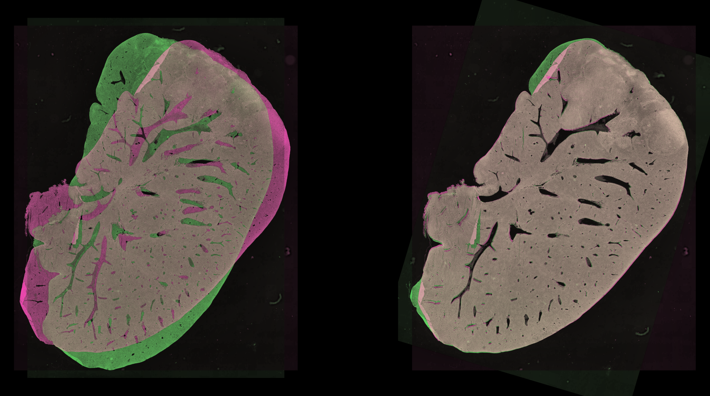

Hey there 👋

I'm Arthur, a PhD candidate at Université Libre de Bruxelles. My thesis, titled *In-vivo ex-vivo image registration in pre-clinical studies*, focuses on integrating diverse information types, scales, and timeframes into a unified reference system.

# Research

### Assessing Local Descriptors for Feature-Based Registration of Whole-Slide Images

**Abstract**: Feature-based registration has become increasingly popular in digital pathology for achieving initial global alignment between image pairs. However, the selection of algorithms used in this approach is often not well-justified. Specifically, the choice of local feature descriptor is rarely, if ever, discussed in the context of digital pathology. The majority of feature-based whole-slide image registration methods rely on the SIFT descriptor. In this study, we demonstrate that the choice of descriptor significantly influences the quality of registration results and that the BRIEF descriptor captures more optimal information for histological image registration.

# Development

I am working on a wrapping library for Ray to seamlessly switch from serial to parallel computing without requiring any code modifications.

